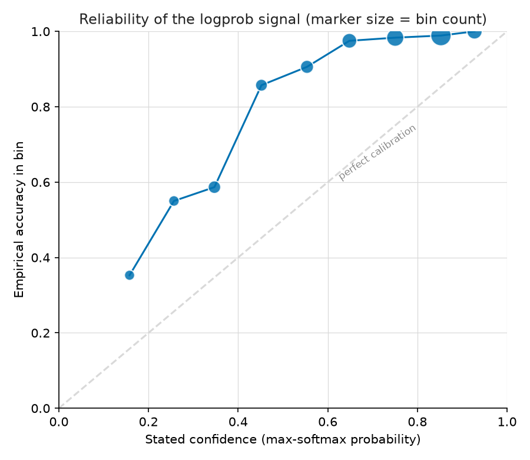
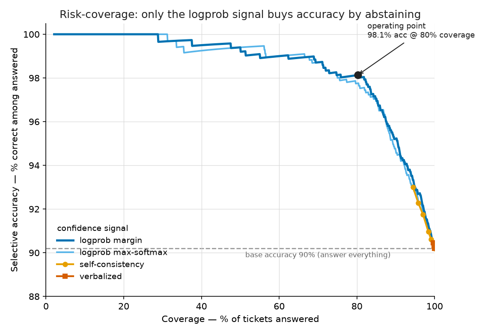
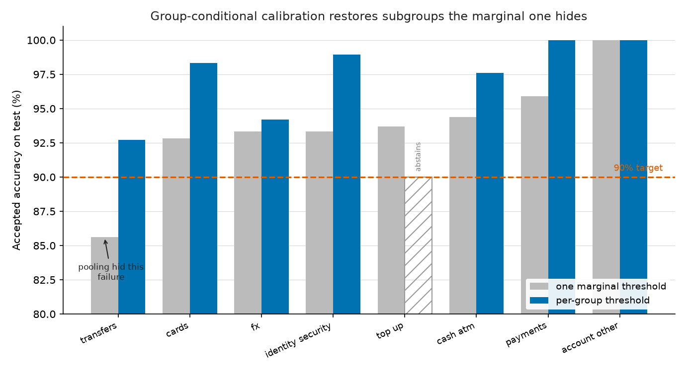

# Findings

An LLM selective-prediction service for banking77 intent classification: a local 4B model
classifies each support message, attaches a calibrated confidence, and **abstains** —
routing to a human — when confidence is too low. The point is not raw accuracy; it is a
*calibrated* accuracy guarantee on the tickets the service chooses to answer.

All numbers below are reproducible from this repo. Every model call is cached; the
statistics are recomputed from those caches.

---

## Headline

> On a held-out test split, the service **answers 80% of tickets at 98.1% accuracy** and
> routes the other 20% to a human. Base accuracy answering *everything* is 90.2%. The
> threshold is calibrated to guarantee **≥95% accuracy on answered tickets with ≥90%
> confidence**, under an exchangeability assumption. It is calibrated on a disjoint
> calibration split and never tuned on test.

Abstention lifts accuracy on answered tickets by **+7.9 points** (90.2% → 98.1%) in
exchange for **19.8%** human-review load — down from the 100% a no-automation baseline
would require.

---

## 1. The base classifier (Phase 1)

Model: `Qwen/Qwen2.5-3B-Instruct`, 4-bit NF4, run entirely on an 8 GB laptop GPU. Chosen
because it is natively implemented in `transformers` (no remote code to desync across
versions), and because a slightly weaker model produces a *richer* accept/abstain tradeoff
than a near-perfect one.

Classification is by **length-normalized log-prob scoring**: for each of the 77 intents we
score the model's log-likelihood of that label string given the prompt, then softmax to a
distribution. This is a scoring forward pass, not free generation — the reason we use
`transformers` rather than a generation-only runtime.

Getting here was a measurement exercise, not a guess. Naive zero-shot scoring was only
44.4%. The fix was **retrieval-augmented prompting**:

| Configuration | Test top-1 accuracy |
|---|---|
| zero-shot, mean-normalized | 44.4% |
| 77-shot (one example per intent) | 64.7% |
| **16 TF-IDF-retrieved few-shot examples** | **89.4%** |

Retrieved shots win because banking77's 77 intents contain near-synonymous pairs (e.g.
`card_arrival` vs `card_delivery_estimate`); neighbours of the actual message demonstrate
exactly the distinctions in play. They are also faster than a fixed 77-shot prompt.

**Honest baseline.** A no-LLM TF-IDF 16-NN vote over the *same* retrieval index scores
**80.6%**. So the LLM's real contribution is **+8.8 points** (paired McNemar p = 5.7e-07):
retrieval supplies the candidates, and the LLM discriminates among the confusable ones.
The 89.4% is an LLM result, but it would be dishonest to report it without the 80.6% next
to it.

Two negative results worth keeping:
- **PMI / prior-correction was tested and rejected** (−3 to −14 points). On a 77-way task
  with near-synonymous labels, dividing out each label's prior destroys real signal about
  which intents are plausible at all.
- **Greedy generation (46.7%) underperforms log-prob scoring**, which independently
  confirms the scoring path is sound rather than hiding a bug.

---

## 2. The three confidence signals (Phase 2)

Each signal scores confidence in the *same* fixed prediction (the log-prob argmax), so the
comparison isolates one variable: which signal best separates right from wrong. Measured as
AUROC over the calibration and test splits (higher = better; 0.5 = useless):

| Signal | AUROC (calibration) | AUROC (test) |
|---|---|---|
| **logprob margin** (top prob − runner-up) | 0.890 | **0.915** |
| logprob max-softmax | 0.878 | 0.909 |
| self-consistency (k=5 @ T=0.7) | 0.634 | 0.650 |
| verbalized ("state a 0–1 confidence") | 0.503 | 0.518 |

- **Logprob is the strong signal, and the *margin* variant is best** — whether there is a
  clear runner-up matters more than the winner's absolute height.
- **Verbalized confidence is essentially a coin flip (~0.50).** The model says "0.95"
  almost regardless of whether it is right. This is the cleanest negative finding.
- **Self-consistency is real but modest (~0.65)**, limited by how peaked the model is: a
  temperature sweep (0.7 / 1.0 / 1.3) showed ~80% of predictions are unanimous across
  samples, so it can only flag the genuinely ambiguous minority.

The log-prob signal is a strong **ranker** but not a calibrated **probability** — the
reliability diagram below shows it is systematically *under-confident* (when it says 0.35,
it is right ~59% of the time). That is exactly why we calibrate a threshold conformally
rather than trusting the raw probability.

---

## 3. Conformal selective calibration (Phase 3)

We pick the abstention threshold with **Learn-then-Test** (Angelopoulos et al. 2021, in the
RCPS family). Each candidate threshold is a hypothesis "accepted-set risk ≥ α"; we form an
exact binomial p-value on the **calibration split** and reject it with a Bonferroni
correction over a fixed threshold grid, so the whole family is valid at once. Among the
thresholds we can certify, we take the one with the highest coverage.

**Guarantee, stated honestly:** with probability ≥ 1 − δ over the calibration draw, the
returned threshold has true accepted-set error ≤ α. The sole assumption is
**exchangeability** of calibration and test. A poorly calibrated score cannot break the
guarantee — it only yields a more conservative threshold (lower coverage).

Applying each signal's calibrated threshold to the frozen test split (δ = 0.10):

| Signal | Target ≥90% | Target ≥95% |
|---|---|---|
| **logprob margin** | 93.0% acc @ 94.8% cov | **98.1% acc @ 80.2% cov** |
| logprob max-softmax | 93.6% acc @ 92.8% cov | 98.2% acc @ 74.1% cov |
| self-consistency | 93.0% acc @ 94.4% cov | *not certifiable* |
| verbalized | *not certifiable* | *not certifiable* |

Three things this shows:
1. **The calibrated threshold holds its promise on test** — every certifiable row achieved
   accepted-accuracy ≥ target. It is *conservative* (98.1% vs a 95% target): distribution-
   free finite-sample validity costs coverage, so the reported coverage is a floor.
2. **The signal ranking transfers exactly from the Phase 2 AUROC.** Logprob-margin buys the
   most coverage; verbalized cannot certify *anything* — the calibration correctly refuses
   to trust a coin-flip signal.
3. **≥98% accepted accuracy is not achievable** at n = 1000 with this model/data (every
   signal abstains on everything). Reported as a limitation, not hidden.

Why the finite-sample correction matters: the naive rule (smallest threshold whose
*empirical* calibration risk ≤ α) lands right at the target's edge with no margin. On a
single test draw it may not visibly violate, but across 300 Monte-Carlo (calibrate, test)
replays it violates the target far more than δ, while Learn-then-Test stays within it
(`tests/test_conformal.py::test_rcps_controls_risk_across_draws`).

---

## 4. The operating point

**logprob-margin signal, target ≥95% accepted accuracy, τ = 0.347** (calibrated on the
calibration split, frozen). On test:

| Metric | Value |
|---|---|
| Raw accuracy (answer everything) | 90.2% |
| **Accepted accuracy (answer above τ)** | **98.1%** (787/802) |
| **Coverage (automation rate)** | **80.2%** (802/1000) |
| Human-review load | 19.8% (198/1000) |
| Accuracy lift from abstention | +7.9 points |

This is the number the service is built around: **answer 4 out of 5 tickets at 98%
accuracy, and route the hard 1-in-5 to a human, with a calibrated guarantee behind it.**

---

## 5. Group-conditional coverage (stretch)

The guarantee above is **marginal** — it controls accepted error *pooled over all 77
intents*. Pooling can hide a subgroup. Grouping the intents into 8 functional areas (cards,
transfers, payments, top-up, cash/ATM, FX, identity/security, account — see `src/groups.py`)
and re-examining the marginal threshold at a 90% target exposes exactly that:

- Under **one marginal threshold**, the pooled accepted accuracy clears 90%, but the
  **`transfers` group sits at 85.6% — well below target.** The marginal guarantee said
  nothing about it.
- **Group-conditional calibration** — a separate Learn-then-Test threshold per group,
  calibrated on that group's own calibration data — gives `transfers` a stricter threshold
  that restores **92.7%** accepted accuracy (≥90%), at the honest cost of lower coverage
  (72.8% vs 92.1%). It certifies **7 of 8 groups**; `top_up` abstains because its per-group
  data can't certify a threshold better than accept-all.

**The finite-sample cost of subgroup guarantees is data.** At the stricter 95% target,
**0 of 8 groups** are per-group certifiable with ~150 calibration examples each — there
simply aren't enough per-group labels to certify 95% distribution-free. This is the real
lesson: a group-conditional guarantee is stronger than a marginal one, but you pay for it
in calibration data proportional to the number of groups. The mechanism is here and works
at 90%; reaching 95% per group would need a larger calibration split.

---

## Assumptions and limits

- **Exchangeability.** The guarantee assumes calibration and test are drawn from the same
  distribution. Real support traffic drifts; the threshold should be re-calibrated on fresh
  labelled data periodically.
- **Marginal, not per-class — quantified in §5.** The headline guarantee is over all intents
  pooled, and §5 shows it hides a real subgroup failure (`transfers`). Group-conditional
  calibration fixes it at the 90% target but needs more per-group data to reach 95%.
- **n = 1000 per split.** Larger calibration data would tighten the conservativeness, let
  stronger targets (≥98%) become certifiable marginally, and make 95% achievable per group.
